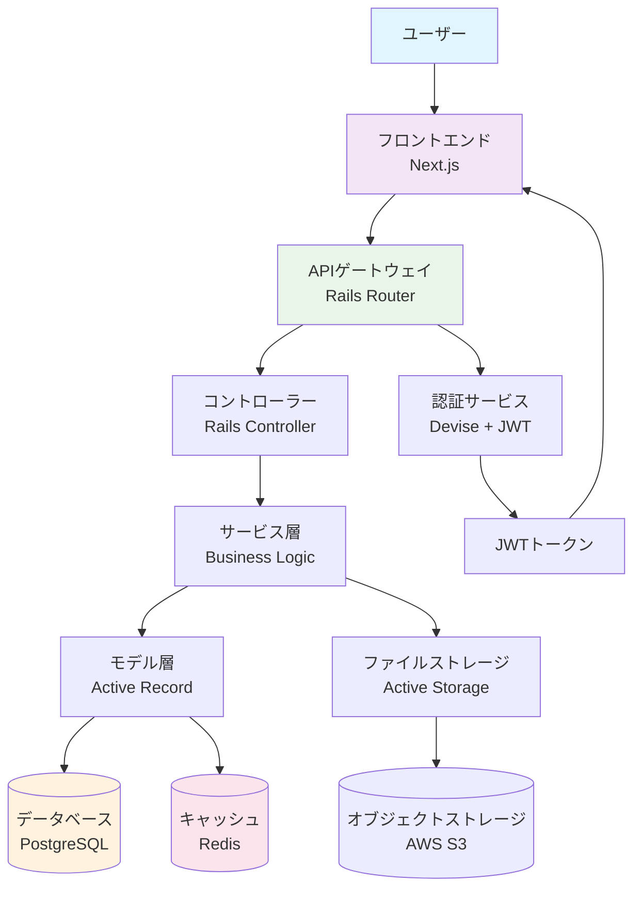
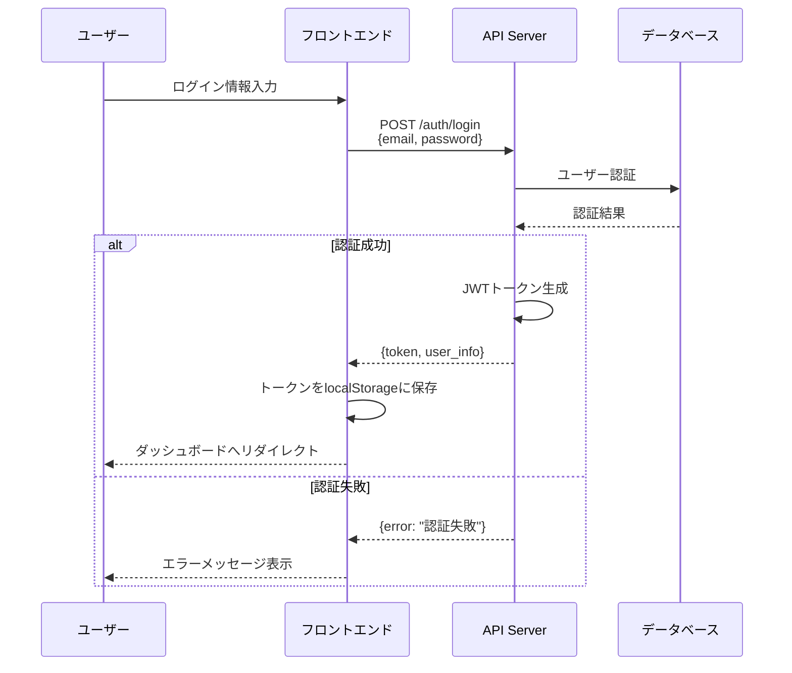
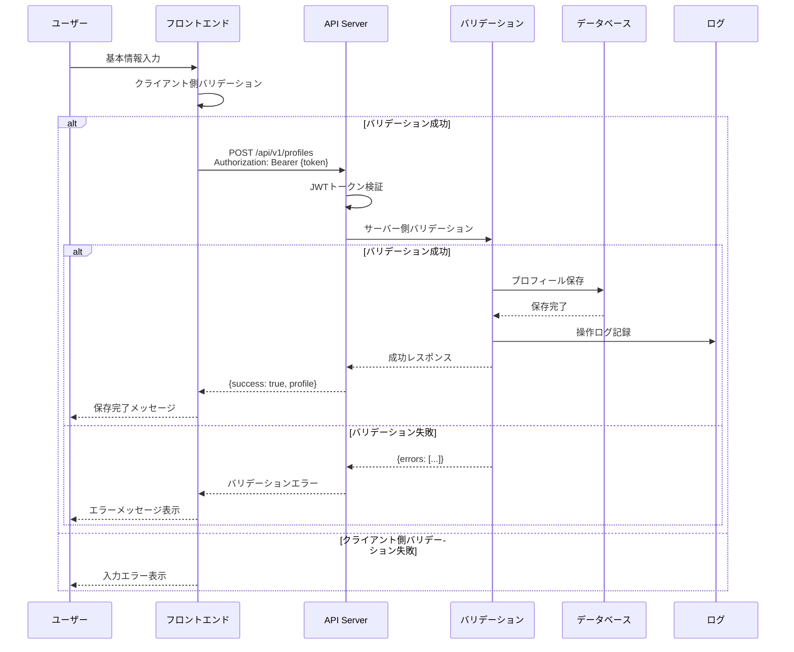
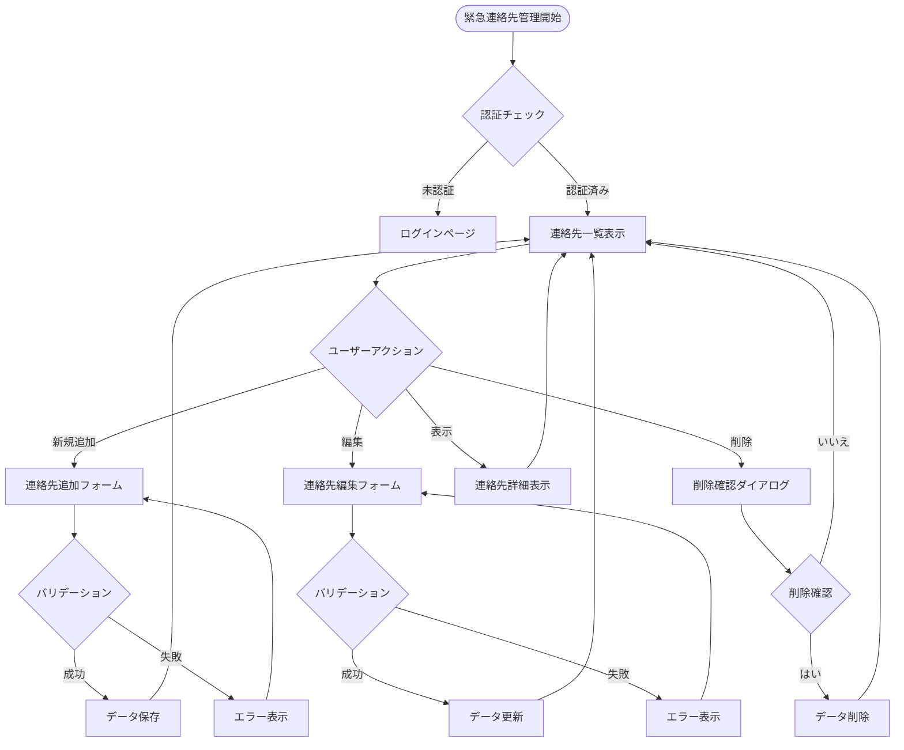
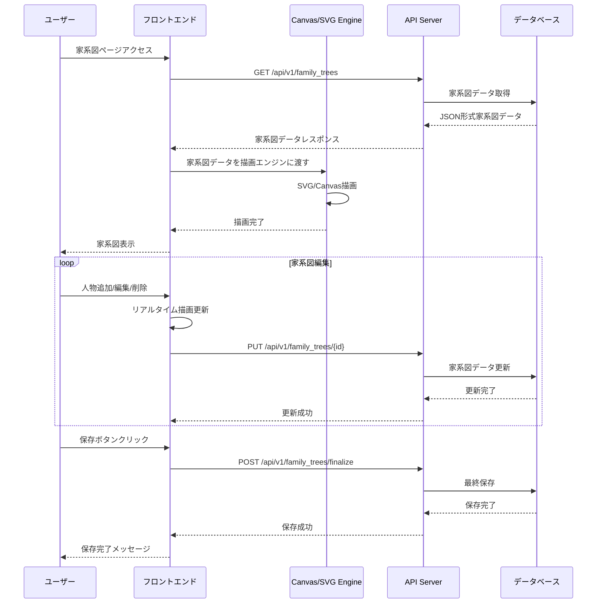
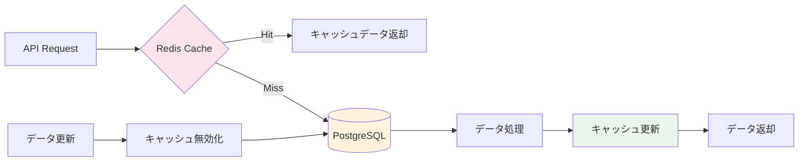
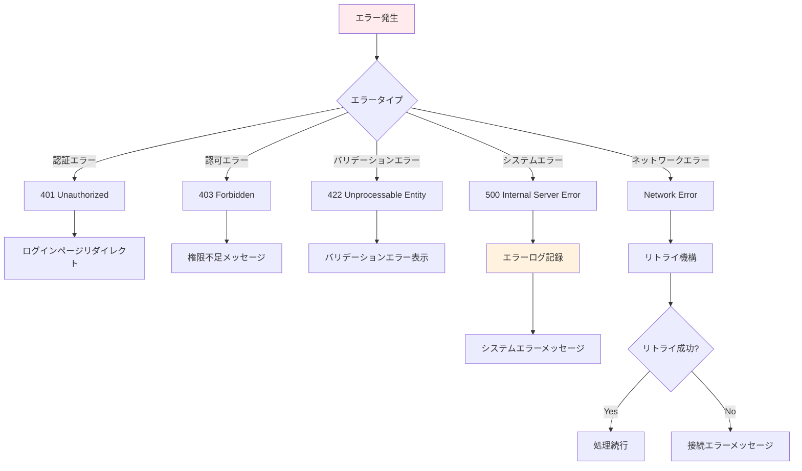
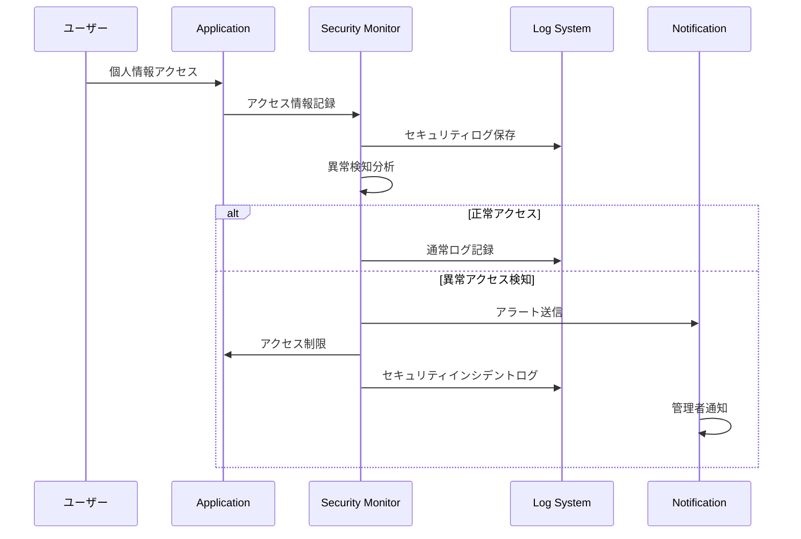
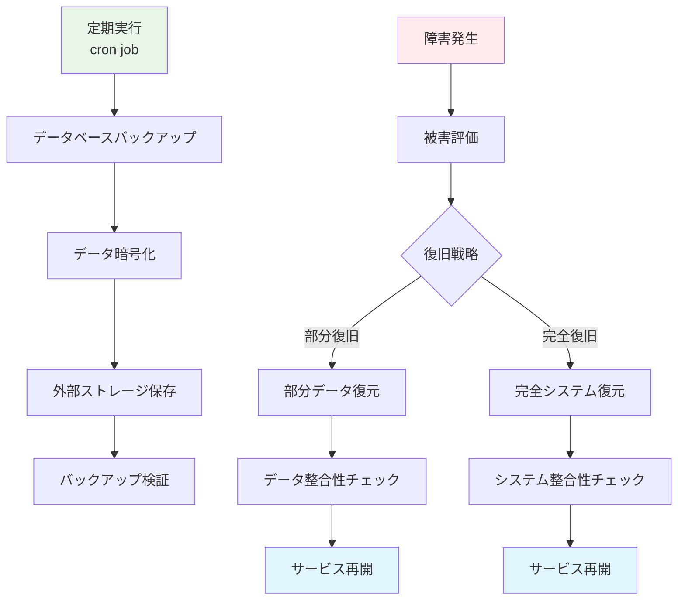

# データフロー図

## システム全体データフロー

```mermaid
flowchart TD
    User[ユーザー] --> Frontend[フロントエンド<br/>Next.js]
    Frontend --> API[APIゲートウェイ<br/>Rails Router]
    API --> Auth[認証サービス<br/>Devise + JWT]
    API --> Controller[コントローラー<br/>Rails Controller]
    Controller --> Service[サービス層<br/>Business Logic]
    Service --> Model[モデル層<br/>Active Record]
    Model --> DB[(データベース<br/>PostgreSQL)]
    Model --> Cache[(キャッシュ<br/>Redis)]
    Service --> Storage[ファイルストレージ<br/>Active Storage]
    Storage --> S3[(オブジェクトストレージ<br/>AWS S3)]
    
    Auth --> JWT[JWTトークン]
    JWT --> Frontend
    
    style User fill:#e1f5fe
    style Frontend fill:#f3e5f5
    style API fill:#e8f5e8
    style DB fill:#fff3e0
    style Cache fill:#fce4ec
```

## ユーザー認証フロー

```mermaid
sequenceDiagram
    participant U as ユーザー
    participant F as フロントエンド
    participant A as API Server
    participant DB as データベース
    
    U->>F: ログイン情報入力
    F->>A: POST /auth/login<br/>{email, password}
    A->>DB: ユーザー認証
    DB-->>A: 認証結果
    
    alt 認証成功
        A->>A: JWTトークン生成
        A-->>F: {token, user_info}
        F->>F: トークンをlocalStorageに保存
        F-->>U: ダッシュボードへリダイレクト
    else 認証失敗
        A-->>F: {error: "認証失敗"}
        F-->>U: エラーメッセージ表示
    end
```

## 基本情報登録フロー

```mermaid
sequenceDiagram
    participant U as ユーザー
    participant F as フロントエンド
    participant A as API Server
    participant V as バリデーション
    participant DB as データベース
    participant L as ログ
    
    U->>F: 基本情報入力
    F->>F: クライアント側バリデーション
    
    alt バリデーション成功
        F->>A: POST /api/v1/profiles<br/>Authorization: Bearer {token}
        A->>A: JWTトークン検証
        A->>V: サーバー側バリデーション
        
        alt バリデーション成功
            V->>DB: プロフィール保存
            DB-->>V: 保存完了
            V->>L: 操作ログ記録
            V-->>A: 成功レスポンス
            A-->>F: {success: true, profile}
            F-->>U: 保存完了メッセージ
        else バリデーション失敗
            V-->>A: {errors: [...]}
            A-->>F: バリデーションエラー
            F-->>U: エラーメッセージ表示
        end
    else クライアント側バリデーション失敗
        F-->>U: 入力エラー表示
    end
```

## 緊急連絡先管理フロー

```mermaid
flowchart TD
    Start([緊急連絡先管理開始]) --> Auth{認証チェック}
    Auth -->|未認証| Login[ログインページ]
    Auth -->|認証済み| List[連絡先一覧表示]
    
    List --> Action{ユーザーアクション}
    Action -->|新規追加| Add[連絡先追加フォーム]
    Action -->|編集| Edit[連絡先編集フォーム]
    Action -->|削除| Delete[削除確認ダイアログ]
    Action -->|表示| View[連絡先詳細表示]
    
    Add --> Validate1{バリデーション}
    Edit --> Validate2{バリデーション}
    Delete --> Confirm{削除確認}
    
    Validate1 -->|成功| Save1[データ保存]
    Validate1 -->|失敗| Error1[エラー表示]
    Validate2 -->|成功| Save2[データ更新]
    Validate2 -->|失敗| Error2[エラー表示]
    Confirm -->|はい| Remove[データ削除]
    Confirm -->|いいえ| List
    
    Save1 --> List
    Save2 --> List
    Remove --> List
    Error1 --> Add
    Error2 --> Edit
    View --> List
```

## 家系図作成フロー

```mermaid
sequenceDiagram
    participant U as ユーザー
    participant F as フロントエンド
    participant C as Canvas/SVG Engine
    participant A as API Server
    participant DB as データベース
    
    U->>F: 家系図ページアクセス
    F->>A: GET /api/v1/family_trees
    A->>DB: 家系図データ取得
    DB-->>A: JSON形式家系図データ
    A-->>F: 家系図データレスポンス
    
    F->>C: 家系図データを描画エンジンに渡す
    C->>C: SVG/Canvas描画
    C-->>F: 描画完了
    F-->>U: 家系図表示
    
    loop 家系図編集
        U->>F: 人物追加/編集/削除
        F->>F: リアルタイム描画更新
        F->>A: PUT /api/v1/family_trees/{id}
        A->>DB: 家系図データ更新
        DB-->>A: 更新完了
        A-->>F: 更新成功
    end
    
    U->>F: 保存ボタンクリック
    F->>A: POST /api/v1/family_trees/finalize
    A->>DB: 最終保存
    DB-->>A: 保存完了
    A-->>F: 保存成功
    F-->>U: 保存完了メッセージ
```

## データ同期・キャッシュフロー

```mermaid
flowchart LR
    Request[API Request] --> Cache{Redis Cache}
    Cache -->|Hit| Return1[キャッシュデータ返却]
    Cache -->|Miss| DB[(PostgreSQL)]
    DB --> Process[データ処理]
    Process --> UpdateCache[キャッシュ更新]
    UpdateCache --> Return2[データ返却]
    
    Update[データ更新] --> InvalidateCache[キャッシュ無効化]
    InvalidateCache --> DB
    
    style Cache fill:#fce4ec
    style DB fill:#fff3e0
    style UpdateCache fill:#e8f5e8
```

## エラーハンドリングフロー

```mermaid
flowchart TD
    Error[エラー発生] --> Type{エラータイプ}
    
    Type -->|認証エラー| Auth[401 Unauthorized]
    Type -->|認可エラー| Forbidden[403 Forbidden]
    Type -->|バリデーションエラー| Validation[422 Unprocessable Entity]
    Type -->|システムエラー| System[500 Internal Server Error]
    Type -->|ネットワークエラー| Network[Network Error]
    
    Auth --> Redirect1[ログインページリダイレクト]
    Forbidden --> Message1[権限不足メッセージ]
    Validation --> Message2[バリデーションエラー表示]
    System --> Log[エラーログ記録]
    Network --> Retry[リトライ機構]
    
    Log --> Message3[システムエラーメッセージ]
    Retry --> Success{リトライ成功?}
    Success -->|Yes| Continue[処理続行]
    Success -->|No| Message4[接続エラーメッセージ]
    
    style Error fill:#ffebee
    style Log fill:#fff3e0
```

## セキュリティ監査ログフロー

```mermaid
sequenceDiagram
    participant U as ユーザー
    participant A as Application
    participant S as Security Monitor
    participant L as Log System
    participant N as Notification
    
    U->>A: 個人情報アクセス
    A->>S: アクセス情報記録
    S->>L: セキュリティログ保存
    
    S->>S: 異常検知分析
    
    alt 正常アクセス
        S->>L: 通常ログ記録
    else 異常アクセス検知
        S->>N: アラート送信
        S->>A: アクセス制限
        S->>L: セキュリティインシデントログ
        N->>N: 管理者通知
    end
```

## バックアップ・復旧フロー

```mermaid
flowchart TD
    Schedule[定期実行<br/>cron job] --> Backup[データベースバックアップ]
    Backup --> Encrypt[データ暗号化]
    Encrypt --> Store[外部ストレージ保存]
    Store --> Verify[バックアップ検証]
    
    Disaster[障害発生] --> Assess[被害評価]
    Assess --> Strategy{復旧戦略}
    Strategy -->|部分復旧| Partial[部分データ復元]
    Strategy -->|完全復旧| Full[完全システム復元]
    
    Partial --> Validate1[データ整合性チェック]
    Full --> Validate2[システム整合性チェック]
    Validate1 --> Service1[サービス再開]
    Validate2 --> Service2[サービス再開]
    
    style Schedule fill:#e8f5e8
    style Disaster fill:#ffebee
    style Service1 fill:#e1f5fe
    style Service2 fill:#e1f5fe
```