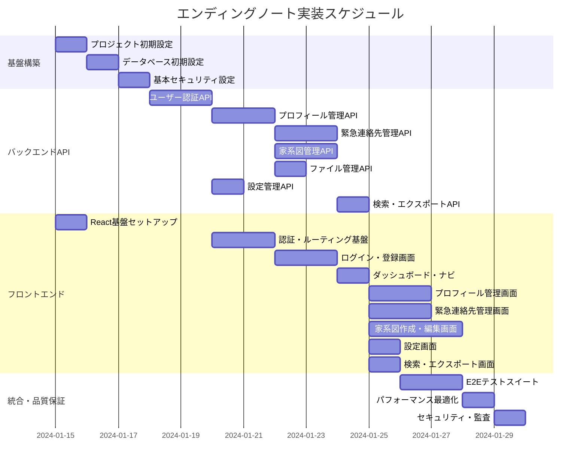

# エンディングノート 実装タスク

## 概要

- **全タスク数**: 28
- **推定作業時間**: 120時間 (15営業日)
- **クリティカルパス**: TASK-001 → TASK-002 → TASK-003 → TASK-101 → TASK-102 → TASK-201 → TASK-202 → TASK-301

## タスク一覧

### フェーズ1: 基盤構築 (15時間)

#### TASK-001: プロジェクト初期設定

- [ ] **タスク完了**
- **タスクタイプ**: DIRECT
- **要件リンク**: アーキテクチャ全般
- **依存タスク**: なし
- **実装詳細**:
  - Railsプロジェクトの初期化 (API mode)
  - Gemfileの設定 (devise-jwt, rack-cors, sidekiq等)
  - 環境設定ファイル (.env, database.yml)
  - Docker Compose設定 (Rails + MySQL + Redis)
  - GitHub Actions CI/CD設定
- **テスト要件**:
  - [ ] サーバー起動テスト
  - [ ] 基本的なRSpecセットアップ
- **完了条件**:
  - [ ] `rails server`でサーバーが起動する
  - [ ] Docker環境で全サービスが起動する
  - [ ] RSpec基本設定が完了している

#### TASK-002: データベース初期設定

- [ ] **タスク完了**
- **タスクタイプ**: DIRECT
- **要件リンク**: REQ-401, NFR-104
- **依存タスク**: TASK-001
- **実装詳細**:
  - MySQLのDockerコンテナ設定
  - データベーススキーマのRailsマイグレーション作成
  - インデックス設定
  - 暗号化機能のセットアップ
  - シードデータの作成
- **テスト要件**:
  - [ ] データベース接続テスト
  - [ ] マイグレーション実行テスト
  - [ ] 暗号化・復号化テスト
- **完了条件**:
  - [ ] 全テーブルが作成されている
  - [ ] インデックスが適用されている
  - [ ] 暗号化機能が動作している

#### TASK-003: 基本セキュリティ設定

- [ ] **タスク完了**
- **タスクタイプ**: DIRECT
- **要件リンク**: REQ-402, REQ-403, NFR-101
- **依存タスク**: TASK-002
- **実装詳細**:
  - JWT認証の基盤設定 (devise-jwt)
  - CORS設定
  - セキュリティヘッダー設定
  - レート制限設定 (rack-attack)
  - 監査ログシステムの基盤
- **テスト要件**:
  - [ ] JWT生成・検証テスト
  - [ ] CORS設定テスト
  - [ ] レート制限テスト
- **完了条件**:
  - [ ] JWT認証システムが動作している
  - [ ] セキュリティヘッダーが設定されている
  - [ ] 監査ログが記録されている

### フェーズ2: バックエンドAPI実装 (45時間)

#### TASK-101: ユーザー認証API

- [ ] **タスク完了**
- **タスクタイプ**: TDD
- **要件リンク**: REQ-101, REQ-102, NFR-101
- **依存タスク**: TASK-003
- **実装詳細**:
  - ユーザーモデルの実装 (Devise)
  - 認証コントローラーの実装
  - JWT認証ロジック
  - パスワードリセット機能
  - メール認証機能
- **単体テスト要件**:
  - [ ] ユーザー登録テスト
  - [ ] ログイン/ログアウトテスト
  - [ ] JWT生成・検証テスト
  - [ ] パスワードリセットテスト
- **統合テスト要件**:
  - [ ] 認証APIエンドポイントテスト
  - [ ] 無効なトークンの処理テスト
- **エラーハンドリング**:
  - [ ] 無効な認証情報
  - [ ] トークン期限切れ
  - [ ] レート制限超過
- **完了条件**:
  - [ ] 全認証エンドポイントが動作している
  - [ ] セキュリティ要件を満たしている

#### TASK-102: プロフィール管理API

- [ ] **タスク完了**
- **タスクタイプ**: TDD
- **要件リンク**: REQ-001, REQ-004, EDGE-104
- **依存タスク**: TASK-101
- **実装詳細**:
  - プロフィールモデルの実装
  - 個人情報暗号化ロジック
  - プロフィールCRUD APIの実装
  - バリデーション実装
  - 監査ログ記録
- **単体テスト要件**:
  - [ ] プロフィール作成・更新・削除テスト
  - [ ] 暗号化・復号化テスト
  - [ ] バリデーションテスト
  - [ ] 監査ログ記録テスト
- **統合テスト要件**:
  - [ ] プロフィールAPIエンドポイントテスト
  - [ ] 認証が必要なAPIのアクセステスト
- **エラーハンドリング**:
  - [ ] バリデーションエラー
  - [ ] 暗号化エラー
  - [ ] 権限エラー
- **完了条件**:
  - [ ] プロフィールCRUD操作が完全に動作している
  - [ ] 個人情報が適切に暗号化されている

#### TASK-103: 緊急連絡先管理API

- [ ] **タスク完了**
- **タスクタイプ**: TDD
- **要件リンク**: REQ-002, REQ-004, EDGE-104
- **依存タスク**: TASK-102
- **実装詳細**:
  - 緊急連絡先モデルの実装
  - 連絡先CRUD APIの実装
  - 優先順位管理機能
  - 一括並び替え機能
  - データ暗号化
- **単体テスト要件**:
  - [ ] 連絡先作成・更新・削除テスト
  - [ ] 優先順位管理テスト
  - [ ] 一括並び替えテスト
  - [ ] データ暗号化テスト
- **統合テスト要件**:
  - [ ] 連絡先APIエンドポイントテスト
  - [ ] 複数連絡先の管理テスト
- **UI/UX要件**:
  - [ ] 優先順位のドラッグ&ドロップ対応準備
- **完了条件**:
  - [ ] 連絡先管理機能が完全に動作している
  - [ ] 優先順位管理が正しく動作している

#### TASK-104: 家系図管理API

- [ ] **タスク完了**
- **タスクタイプ**: TDD
- **要件リンク**: REQ-003, REQ-004, EDGE-203
- **依存タスク**: TASK-102
- **実装詳細**:
  - 家系図・メンバー・関係のモデル実装
  - 家系図CRUD APIの実装
  - メンバー・関係の管理API
  - 循環参照検証ロジック
  - JSONデータ構造の最適化
- **単体テスト要件**:
  - [ ] 家系図作成・更新・削除テスト
  - [ ] メンバー・関係管理テスト
  - [ ] 循環参照検証テスト
  - [ ] データ整合性テスト
- **統合テスト要件**:
  - [ ] 家系図APIエンドポイントテスト
  - [ ] 複雑な家系図構造のテスト
- **エラーハンドリング**:
  - [ ] 循環参照エラー
  - [ ] データ整合性エラー
- **完了条件**:
  - [ ] 家系図機能が完全に動作している
  - [ ] データ整合性が保たれている

#### TASK-105: ファイル管理API

- [ ] **タスク完了**
- **タスクタイプ**: TDD
- **要件リンク**: REQ-301, NFR-104
- **依存タスク**: TASK-102
- **実装詳細**:
  - Active Storageの設定
  - ファイルアップロード・削除API
  - 画像リサイズ処理
  - セキュリティスキャン
  - ファイルタイプ制限
- **単体テスト要件**:
  - [ ] ファイルアップロードテスト
  - [ ] ファイル削除テスト
  - [ ] セキュリティスキャンテスト
  - [ ] ファイルタイプ制限テスト
- **統合テスト要件**:
  - [ ] ファイルAPIエンドポイントテスト
  - [ ] 大容量ファイルテスト
- **完了条件**:
  - [ ] ファイル管理機能が動作している
  - [ ] セキュリティが確保されている

#### TASK-106: 設定管理API

- [ ] **タスク完了**
- **タスクタイプ**: TDD
- **要件リンク**: NFR-201, NFR-202, NFR-203
- **依存タスク**: TASK-101
- **実装詳細**:
  - ユーザー設定モデルの実装
  - 設定CRUD APIの実装
  - デフォルト設定の管理
  - テーマ・言語・アクセシビリティ設定
- **単体テスト要件**:
  - [ ] 設定作成・更新テスト
  - [ ] デフォルト設定適用テスト
  - [ ] 設定値バリデーションテスト
- **統合テスト要件**:
  - [ ] 設定APIエンドポイントテスト
- **完了条件**:
  - [ ] ユーザー設定機能が動作している

#### TASK-107: 検索・エクスポートAPI

- [ ] **タスク完了**
- **タスクタイプ**: TDD
- **要件リンク**: REQ-301, REQ-302
- **依存タスク**: TASK-103, TASK-104
- **実装詳細**:
  - 全文検索機能の実装
  - データエクスポート機能
  - バックアップ生成機能
  - 非同期ジョブ処理 (Sidekiq)
- **単体テスト要件**:
  - [ ] 検索機能テスト
  - [ ] エクスポート機能テスト
  - [ ] バックグラウンドジョブテスト
- **統合テスト要件**:
  - [ ] 検索APIエンドポイントテスト
  - [ ] エクスポートプロセステスト
- **完了条件**:
  - [ ] 検索・エクスポート機能が動作している

### フェーズ3: フロントエンド実装 (50時間)

#### TASK-201: React基盤セットアップ

- [ ] **タスク完了**
- **タスクタイプ**: DIRECT
- **要件リンク**: アーキテクチャ全般
- **依存タスク**: なし (並行実行可能)
- **実装詳細**:
  - Vite + React + TypeScriptプロジェクト初期化
  - ESLint, Prettier設定
  - Tailwind CSS設定
  - React Router設定
  - Shadcn/ui, Radix UI設定
  - 開発サーバー設定
- **テスト要件**:
  - [ ] Vite開発サーバー起動テスト
  - [ ] TypeScriptコンパイルテスト
  - [ ] Tailwind CSS適用テスト
- **完了条件**:
  - [ ] 開発環境が正常に動作している
  - [ ] 基本的なページルーティングが動作している

#### TASK-202: 認証・ルーティング基盤

- [ ] **タスク完了**
- **タスクタイプ**: TDD
- **要件リンク**: REQ-101, REQ-102
- **依存タスク**: TASK-201, TASK-101
- **実装詳細**:
  - 認証状態管理 (Zustand)
  - JWT管理ロジック
  - React Router Protected Route
  - 認証フック (useAuth)
  - API客户端設定 (axios)
- **単体テスト要件**:
  - [ ] 認証状態管理テスト
  - [ ] JWT管理テスト
  - [ ] Protected Routeテスト
  - [ ] API clientテスト
- **統合テスト要件**:
  - [ ] 認証フローテスト
  - [ ] 自動ログアウトテスト
- **UI/UX要件**:
  - [ ] ローディング状態: スケルトンローダー
  - [ ] エラー表示: トースト通知
  - [ ] リダイレクト処理: スムーズな画面遷移
- **完了条件**:
  - [ ] 認証機能が完全に動作している
  - [ ] ルーティングが正しく動作している

#### TASK-203: ログイン・登録画面

- [ ] **タスク完了**
- **タスクタイプ**: TDD
- **要件リンク**: REQ-101, NFR-201, NFR-203
- **依存タスク**: TASK-202
- **実装詳細**:
  - ログイン・登録フォームコンポーネント
  - React Hook Form + Zod バリデーション
  - パスワード強度チェック
  - アクセシビリティ対応 (ARIA, キーボード操作)
  - レスポンシブデザイン
- **単体テスト要件**:
  - [ ] フォームバリデーションテスト
  - [ ] 送信処理テスト
  - [ ] エラー表示テスト
- **統合テスト要件**:
  - [ ] E2E認証フローテスト
- **UI/UX要件**:
  - [ ] ローディング状態: ボタン無効化 + スピナー
  - [ ] エラー表示: インラインエラー + トースト
  - [ ] モバイル対応: タッチ最適化
  - [ ] アクセシビリティ: スクリーンリーダー対応
  - [ ] 高齢者配慮: 大きなフォントサイズ、コントラスト
- **完了条件**:
  - [ ] ログイン・登録が完全に動作している
  - [ ] アクセシビリティ要件を満たしている

#### TASK-204: ダッシュボード・ナビゲーション

- [ ] **タスク完了**
- **タスクタイプ**: TDD
- **要件リンク**: REQ-005, NFR-201, NFR-202
- **依存タスク**: TASK-203
- **実装詳細**:
  - ダッシュボードレイアウト
  - ナビゲーションメニュー
  - ユーザー情報表示
  - 設定・ログアウトメニュー
  - レスポンシブナビゲーション
- **単体テスト要件**:
  - [ ] ナビゲーションコンポーネントテスト
  - [ ] レスポンシブ表示テスト
- **統合テスト要件**:
  - [ ] ページ遷移テスト
- **UI/UX要件**:
  - [ ] ローディング状態: スケルトンダッシュボード
  - [ ] エラー表示: エラーバウンダリ
  - [ ] モバイル対応: ハンバーガーメニュー
  - [ ] アクセシビリティ: キーボードナビゲーション
- **完了条件**:
  - [ ] ダッシュボードが動作している
  - [ ] ナビゲーションが機能している

#### TASK-205: プロフィール管理画面

- [ ] **タスク完了**
- **タスクタイプ**: TDD
- **要件リンク**: REQ-001, REQ-004, EDGE-104
- **依存タスク**: TASK-204, TASK-102
- **実装詳細**:
  - プロフィール表示・編集フォーム
  - 段階的フォーム入力 (ステップ形式)
  - リアルタイムバリデーション
  - 自動保存機能
  - データ暗号化の透過的処理
- **単体テスト要件**:
  - [ ] フォームコンポーネントテスト
  - [ ] バリデーションテスト
  - [ ] 自動保存テスト
- **統合テスト要件**:
  - [ ] プロフィール更新フローテスト
- **UI/UX要件**:
  - [ ] ローディング状態: フォームローディング + 保存中表示
  - [ ] エラー表示: フィールドごとのエラー表示
  - [ ] モバイル対応: モバイル最適化フォーム
  - [ ] アクセシビリティ: ラベル・説明文の充実
  - [ ] 高齢者配慮: 分かりやすい入力ガイド
- **完了条件**:
  - [ ] プロフィール管理が完全に動作している
  - [ ] ユーザビリティが高い

#### TASK-206: 緊急連絡先管理画面

- [ ] **タスク完了**
- **タスクタイプ**: TDD
- **要件リンク**: REQ-002, REQ-004
- **依存タスク**: TASK-204, TASK-103
- **実装詳細**:
  - 連絡先一覧・追加・編集・削除
  - ドラッグ&ドロップによる優先順位変更
  - 連絡先カード形式表示
  - 一括操作機能
  - 検索・フィルター機能
- **単体テスト要件**:
  - [ ] 連絡先コンポーネントテスト
  - [ ] ドラッグ&ドロップテスト
  - [ ] 検索・フィルターテスト
- **統合テスト要件**:
  - [ ] 連絡先管理フローテスト
- **UI/UX要件**:
  - [ ] ローディング状態: リスト・カードローディング
  - [ ] エラー表示: 操作ごとのエラーフィードバック
  - [ ] モバイル対応: スワイプ操作対応
  - [ ] アクセシビリティ: ドラッグ&ドロップの代替操作
- **完了条件**:
  - [ ] 連絡先管理が完全に動作している
  - [ ] 直感的な操作が可能

#### TASK-207: 家系図作成・編集画面

- [ ] **タスク完了**
- **タスクタイプ**: TDD
- **要件リンク**: REQ-003, REQ-004, EDGE-203
- **依存タスク**: TASK-204, TASK-104
- **実装詳細**:
  - Canvas/SVGベースの家系図エディター
  - ドラッグ&ドロップによるメンバー配置
  - 関係線の自動描画
  - ズーム・パン機能
  - メンバー詳細編集モーダル
- **単体テスト要件**:
  - [ ] 家系図コンポーネントテスト
  - [ ] メンバー操作テスト
  - [ ] 関係管理テスト
- **統合テスト要件**:
  - [ ] 家系図作成フローテスト
  - [ ] 複雑な家系図テスト
- **UI/UX要件**:
  - [ ] ローディング状態: 家系図読み込み中表示
  - [ ] エラー表示: 操作エラーの視覚的フィードバック
  - [ ] モバイル対応: タッチ操作最適化
  - [ ] アクセシビリティ: 代替テキスト、キーボード操作
- **完了条件**:
  - [ ] 家系図機能が完全に動作している
  - [ ] 使いやすいエディターが提供されている

#### TASK-208: 設定画面

- [ ] **タスク完了**
- **タスクタイプ**: TDD
- **要件リンク**: NFR-201, NFR-202, NFR-203
- **依存タスク**: TASK-204, TASK-106
- **実装詳細**:
  - ユーザー設定管理画面
  - テーマ・言語切り替え
  - アクセシビリティ設定
  - 通知設定
  - プライバシー設定
- **単体テスト要件**:
  - [ ] 設定コンポーネントテスト
  - [ ] テーマ切り替えテスト
  - [ ] 設定保存テスト
- **統合テスト要件**:
  - [ ] 設定変更反映テスト
- **UI/UX要件**:
  - [ ] ローディング状態: 設定読み込み・保存中
  - [ ] エラー表示: 設定保存エラー
  - [ ] モバイル対応: 設定項目の最適化
  - [ ] アクセシビリティ: 設定の即座反映
- **完了条件**:
  - [ ] 設定機能が完全に動作している
  - [ ] アクセシビリティ設定が反映される

#### TASK-209: 検索・エクスポート画面

- [ ] **タスク完了**
- **タスクタイプ**: TDD
- **要件リンク**: REQ-301, REQ-302
- **依存タスク**: TASK-204, TASK-107
- **実装詳細**:
  - 全データ検索機能
  - 高度な検索フィルター
  - データエクスポート画面
  - エクスポート進捗表示
  - ダウンロードリンク管理
- **単体テスト要件**:
  - [ ] 検索コンポーネントテスト
  - [ ] フィルター機能テスト
  - [ ] エクスポート機能テスト
- **統合テスト要件**:
  - [ ] 検索・エクスポートフローテスト
- **UI/UX要件**:
  - [ ] ローディング状態: 検索中・エクスポート進行中
  - [ ] エラー表示: 検索・エクスポートエラー
  - [ ] モバイル対応: 検索UI最適化
- **完了条件**:
  - [ ] 検索・エクスポート機能が動作している

### フェーズ4: 統合・品質保証 (10時間)

#### TASK-301: E2Eテストスイート

- [ ] **タスク完了**
- **タスクタイプ**: TDD
- **要件リンク**: 全要件
- **依存タスク**: TASK-209
- **実装詳細**:
  - Playwright/Cypressセットアップ
  - 主要ユーザーフローのE2Eテスト
  - クロスブラウザテスト
  - モバイルデバイステスト
  - CI/CD統合
- **テスト要件**:
  - [ ] ユーザー登録～ログインフロー
  - [ ] プロフィール作成～更新フロー
  - [ ] 緊急連絡先管理フロー
  - [ ] 家系図作成フロー
  - [ ] 設定変更フロー
- **完了条件**:
  - [ ] 全E2Eテストがパスしている
  - [ ] CI/CDパイプラインが動作している

#### TASK-302: パフォーマンス最適化

- [ ] **タスク完了**
- **タスクタイプ**: TDD
- **要件リンク**: NFR-001, NFR-002
- **依存タスク**: TASK-301
- **実装詳細**:
  - フロントエンドバンドル最適化
  - 画像最適化・遅延読み込み
  - API応答時間最適化
  - データベースクエリ最適化
  - キャッシュ戦略実装
- **テスト要件**:
  - [ ] ページ読み込み速度テスト
  - [ ] APIレスポンス時間テスト
  - [ ] 負荷テスト
- **完了条件**:
  - [ ] パフォーマンス要件を満たしている
  - [ ] 負荷テストにパスしている

#### TASK-303: セキュリティ・アクセシビリティ監査

- [ ] **タスク完了**
- **タスクタイプ**: TDD
- **要件リンク**: NFR-101～104, NFR-203
- **依存タスク**: TASK-302
- **実装詳細**:
  - セキュリティ脆弱性スキャン
  - アクセシビリティ監査 (WCAG 2.1 AA準拠)
  - ペネトレーションテスト
  - コードセキュリティレビュー
- **テスト要件**:
  - [ ] セキュリティスキャンパス
  - [ ] アクセシビリティテストパス
  - [ ] コードレビュー完了
- **完了条件**:
  - [ ] セキュリティ要件を満たしている
  - [ ] アクセシビリティ要件を満たしている

## 実行順序

## タスク分類サマリー

### TDDタスク (20個)
テスト駆動開発で進める開発タスク
- バックエンドAPI: 7個
- フロントエンド: 8個  
- 品質保証: 5個

### DIRECTタスク (8個)
直接実装する設定・環境構築タスク
- 基盤構築: 3個
- フロントエンド基盤: 1個

## 並行実行可能なタスクグループ

### グループ1 (基盤構築後)
- TASK-201 (React基盤) は TASK-101 (認証API) と並行実行可能
- TASK-105 (ファイル管理) と TASK-106 (設定管理) は並行実行可能

### グループ2 (API実装後)  
- TASK-205 (プロフィール画面) と TASK-206 (連絡先画面) は並行実行可能
- TASK-207 (家系図画面) は独立性が高い

### グループ3 (画面実装後)
- TASK-208 (設定画面) と TASK-209 (検索画面) は並行実行可能

## 重要な注意事項

### セキュリティ要件
- 全ての個人情報は暗号化して保存
- JWT認証の適切な実装
- 監査ログの確実な記録

### アクセシビリティ要件  
- WCAG 2.1 AA準拠
- 高齢者向けのUI/UX配慮
- キーボード操作の完全サポート

### パフォーマンス要件
- API応答時間3秒以内
- 同時接続100人対応
- モバイルデバイス最適化